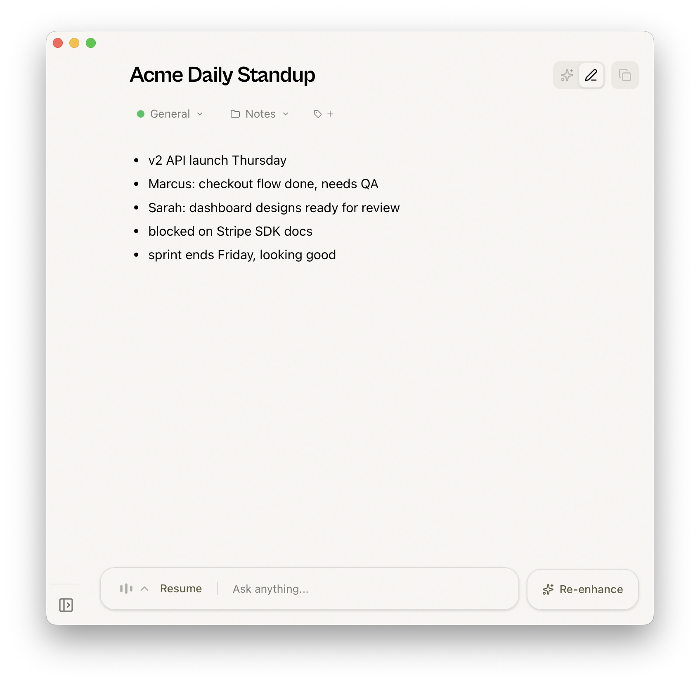
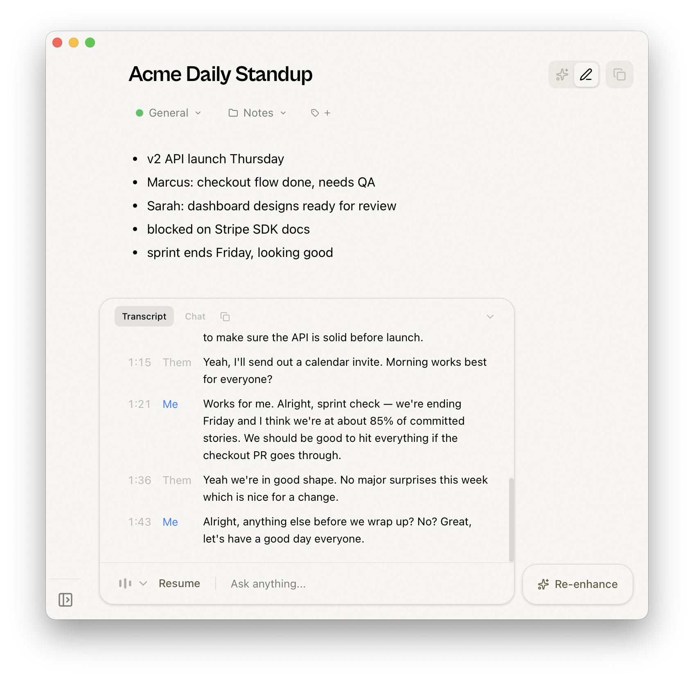
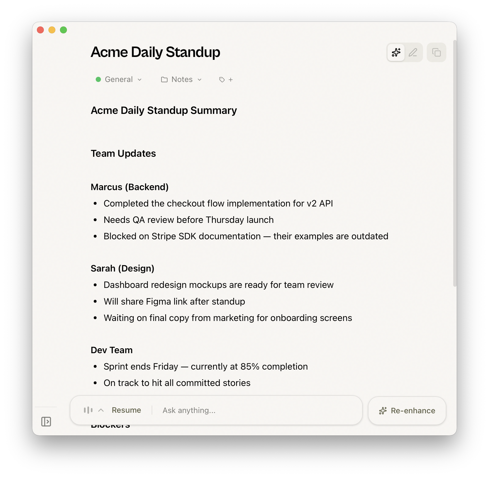
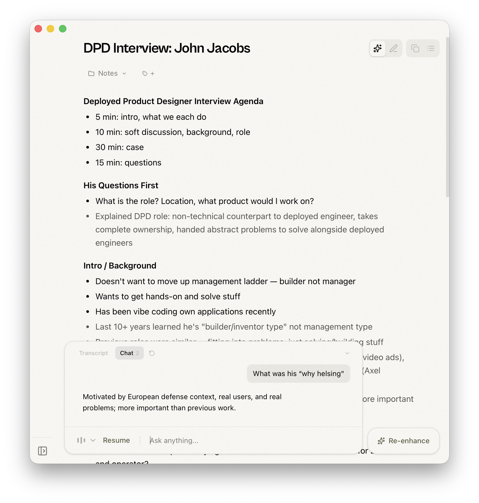

# Talky

**A free, open source meeting notes app with live transcription and AI-powered note enhancement.**

Talky is a desktop application built with Tauri (Rust + React/TypeScript) that lets you take notes during meetings while automatically transcribing both sides of the conversation. Transcription runs entirely on your device — your audio never leaves your computer. Optional AI features let you enhance your notes and chat with your transcript.

## Features

<table>
<tr>
<td width="50%">

<p><strong>Take your own notes</strong><br/>
Jot down thoughts, agenda items, and key points in the built-in editor while Talky records and transcribes in the background.</p>
</td>
<td width="50%">

<p><strong>View the full transcript in real time</strong><br/>
Access the complete timestamped transcript as it's generated, with your mic and speaker audio clearly separated.</p>
</td>
</tr>
<tr>
<td width="50%">

<p><strong>Enhance with AI</strong><br/>
One click transforms your rough notes into polished, detailed meeting notes — AI fills in context from the transcript while preserving your original thoughts.</p>
</td>
<td width="50%">

<p><strong>Ask any question</strong><br/>
Chat with your meeting in natural language. Ask about decisions, action items, or anything discussed — AI has full context of your notes and transcript.</p>
</td>
</tr>
</table>

## Quick Start

### Installation

#### macOS (quick install)

```bash
curl -fsSL https://raw.githubusercontent.com/itskhalil/talky/main/install.sh | bash
```

#### Windows (quick install)

```powershell
irm https://raw.githubusercontent.com/itskhalil/talky/main/install.ps1 | iex
```

### Development Setup

For detailed build instructions including platform-specific requirements, see [BUILD.md](BUILD.md).

## How It Works

1. **Create a Note** — open the app and start a new note
2. **Type your own notes** — jot down thoughts, agenda items, or context in the built-in editor
3. **Start recording** — hit record and Talky transcribes both your microphone and system audio (speaker) in real time
4. **Stop and resume** — pause recording whenever you want, start again within the same note
5. **Enhance with AI** — use AI to polish your notes, filling in details you missed from the transcript
6. **Chat** — ask questions about your meeting and get answers based on your notes and transcript

### Local Transcription

All transcription happens on your device:

- Mic and speaker audio are captured and transcribed separately so you can tell who said what
- Silence is filtered using VAD (Voice Activity Detection) with Silero
- Transcription uses **Parakeet models**

### AI Features

Talky integrates with AI providers for enhanced productivity:

- **Enhanced Notes** — AI merges your rough notes with transcript details to create polished, comprehensive meeting notes. Your original notes are preserved and clearly marked alongside AI-extracted content.
- **Chat** — Ask questions about your meeting in natural language. The AI has full context of your notes and transcript to provide relevant answers.

#### Supported AI Providers

- **Local**: Ollama, Apple Intelligence (macOS Apple Silicon)
- **Cloud**: OpenAI, Anthropic, OpenRouter, Groq, Cerebras (disabled by default, enable via debug pane)
- **Custom**: Any OpenAI-compatible endpoint

## Architecture

Talky is built as a Tauri application combining:

- **Frontend**: React + TypeScript with Tailwind CSS for the notes and settings UI
- **Backend**: Rust for system integration, audio processing, and ML inference
- **Core Libraries**:
  - `transcribe-rs`: Local speech recognition with Whisper and Parakeet models
  - `cpal`: Cross-platform audio I/O
  - `vad-rs`: Voice Activity Detection
  - `rubato`: Audio resampling

### Debug Mode

Talky includes a debug pane for development, troubleshooting, and advanced settings like enabling cloud AI providers. Access it by pressing:

- **macOS**: `Cmd+Shift+D`
- **Windows**: `Ctrl+Shift+D`

### Platform Support

- **macOS** (Intel and Apple Silicon)
- **Windows** (x64 and ARM64)

## License

MIT License - see [LICENSE](LICENSE) file for details.

## Acknowledgments

- **Handy** by CJ Pais, for inspiration and the core transcription stack
- **Whisper** by OpenAI for the speech recognition model
- **whisper.cpp and ggml** for amazing cross-platform whisper inference/acceleration
- **Silero** for great lightweight VAD
- **Tauri** team for the excellent Rust-based app framework
