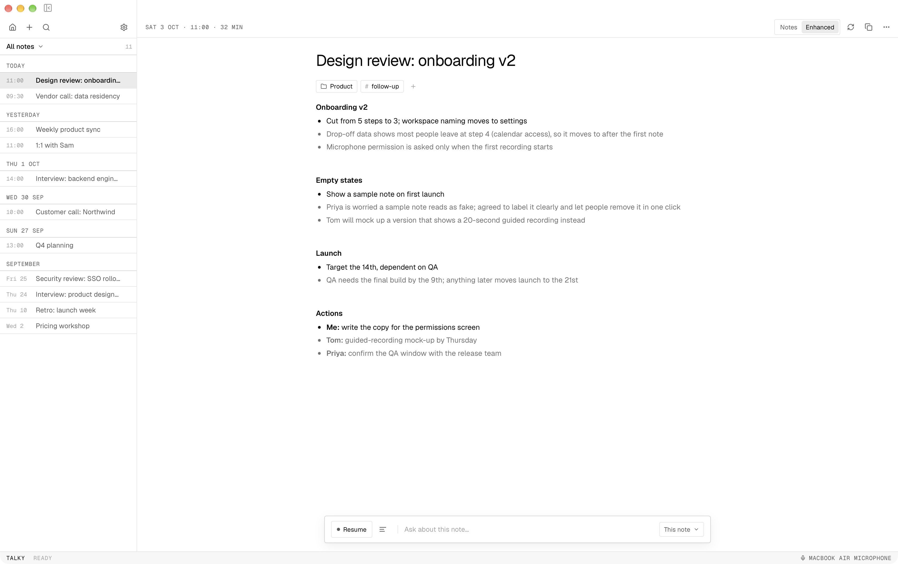
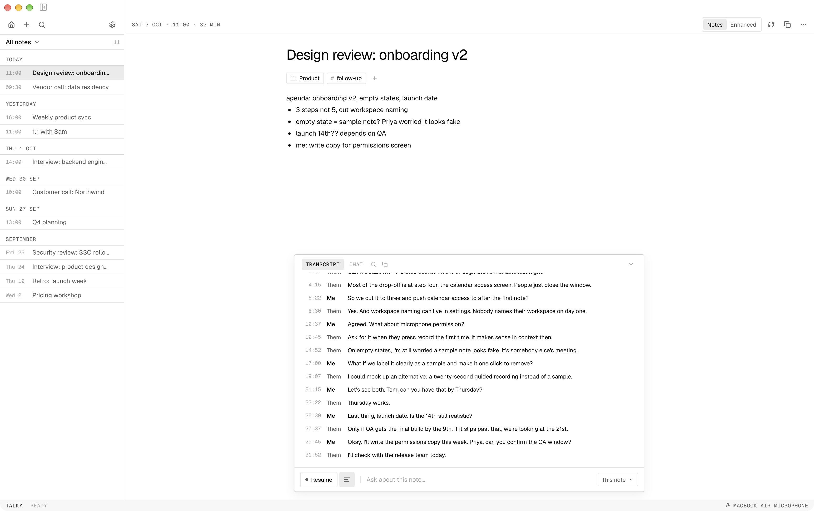
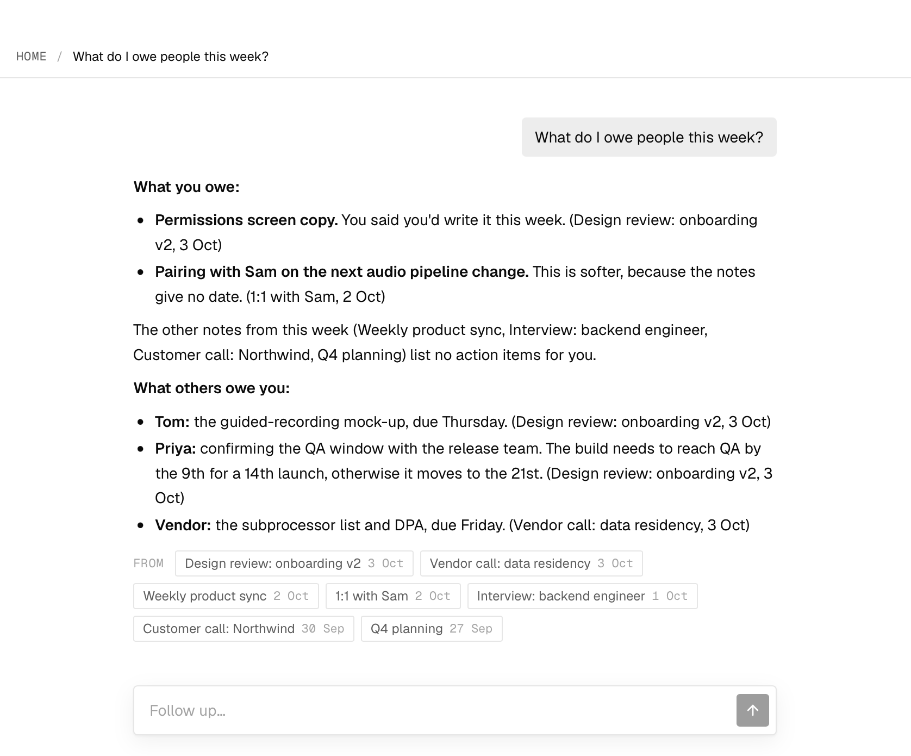
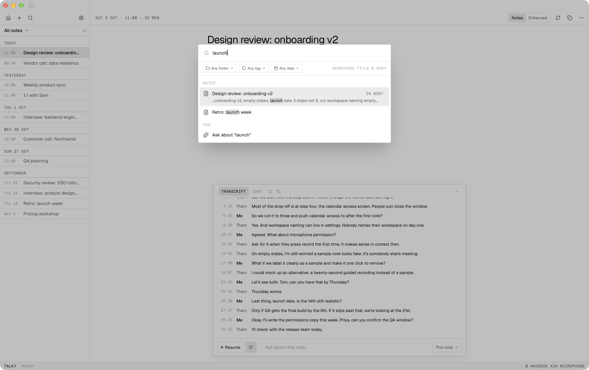
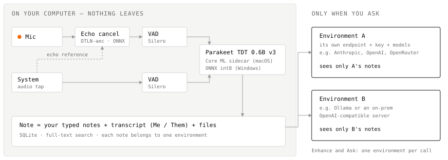

<h1 align="center">Talky</h1>

<p align="center">
  Meeting notes that write themselves, without your audio leaving your computer.
</p>

<p align="center">
  <a href="https://github.com/itskhalil/talky/releases/latest"></a>
  
  <a href="LICENSE"></a>
</p>

<p align="center">
  
</p>

You type rough notes during a meeting. Talky transcribes both sides of the call on your machine, then turns your notes into a full set of meeting notes in your own voice: your lines stay as you wrote them, and what you missed comes from the transcript, shown in grey.

Transcription runs locally with NVIDIA's Parakeet model. None of your meeting content leaves your machine until you press Enhance or ask a question, and then it goes only to the AI endpoint you chose for that note.

## What it does

<table>
<tr>
<td width="50%" valign="top">

<p><b>Take notes, Talky listens.</b> Your microphone and the other side of the call are captured as separate streams, so the transcript knows who said what.</p>
</td>
<td width="50%" valign="top">

<p><b>Ask across meetings.</b> "What did we decide this week?" The model searches and reads your notes with tools, and cites the meetings it used.</p>
</td>
</tr>
<tr>
<td width="50%" valign="top">

<p><b>Find anything.</b> Full-text search over titles, notes and transcripts, with filters for folder, tag and date. Any search can become a question.</p>
</td>
<td width="50%" valign="middle">
<p><b>Keep confidential meetings separate.</b> Each note belongs to one environment, and every AI call goes to that environment's endpoint with that environment's notes only.</p>
</td>
</tr>
</table>

## Install

**macOS** (Apple Silicon)

```bash
curl -fsSL https://raw.githubusercontent.com/itskhalil/talky/main/scripts/install.sh | bash
```

**Windows** (x64 and ARM64; builds in CI, lightly tested)

```powershell
irm https://raw.githubusercontent.com/itskhalil/talky/main/scripts/install.ps1 | iex
```

Or download a build from [Releases](https://github.com/itskhalil/talky/releases/latest).

## How it works

<p align="center">
  
</p>

**Two streams, not one.** The microphone and system audio are recorded separately: a Core Audio process tap on macOS, WASAPI loopback on Windows. The mic stream runs through a neural echo canceller (DTLN-aec, two small ONNX models) using the system audio as its reference, so the other side's voice coming out of your speakers isn't transcribed twice. Each stream is segmented with Silero VAD and transcribed separately, which gives "Me" and "Them" labels without speaker diarisation.

**On-device ASR.** Parakeet TDT 0.6B v3. On macOS it runs in a small Swift sidecar on Core ML (via FluidAudio), so inference can run on the Neural Engine. The sidecar talks to the Rust app over stdio with a length-prefixed binary protocol. On Windows the same model runs as int8 ONNX.

**Environments.** An environment is an endpoint, an API key and a pair of models: one for enhancing notes and one for chat. Anything that speaks the Anthropic or OpenAI APIs works, including Ollama and on-prem servers. A note belongs to exactly one environment. Asking across notes uses two tools, `search_notes` and `read_note`, and both check every note against the environment the question was asked in. The boundary is enforced in code, not in the prompt.

**Storage.** Notes, transcripts and files live in SQLite on your machine, with an FTS5 index for search.

## Engineering notes

A few parts of the codebase that might be interesting if you work on models or evals.

- **Prompt evals with an LLM judge** ([`.AI/`](.AI)). The note-enhancement prompt is tested against a suite of meeting cases with [promptfoo](https://promptfoo.dev). A judge model first checks for fatal flaws, such as writing a summary instead of notes or addressing the user as "you", then scores the output on several dimensions. A fatal flaw caps the score however good the rest is. How to read the results, including where the judge gets it wrong, is in [`EVAL_REVIEW_GUIDE.md`](.AI/EVAL_REVIEW_GUIDE.md). Needs model API keys.

  ```bash
  npm run eval        # runs each case 4 times
  npm run eval:view   # browse results
  ```

- **Audio pipeline replay** ([`src-tauri/src/replay/`](src-tauri/src/replay)). Talky can save raw two-channel recordings of a meeting (a debug setting). The `replay` binary runs them back through the real pipeline (echo cancellation, VAD, ASR) and scores the result against a hand-checked transcript, by word error rate and by how often words are attributed to the right channel. `sweep` does this across a grid of pipeline parameters.

  ```bash
  cd src-tauri && cargo run --release --bin replay -- run --help
  ```

- **Agent checks** ([`scripts/ask/`](scripts/ask)). The ask-across-notes agent has no React or Tauri dependencies, so it runs in Node. `npm run ask:check` tests the environment boundary deterministically, then asks real questions of a demo data directory.

- **Demo data** ([`scripts/demo/`](scripts/demo)). Every screenshot here comes from a separate copy of the app seeded with invented meetings, so no real notes are in the repo.

## Development

Requires [Rust](https://rustup.rs) (stable), [Node.js](https://nodejs.org) and the [Tauri prerequisites](https://tauri.app/start/prerequisites/) for your platform.

```bash
git clone https://github.com/itskhalil/talky.git
cd talky
npm install
npm run tauri dev
```

On macOS, if CMake complains, prefix with `CMAKE_POLICY_VERSION_MINIMUM=3.5`. `Cmd+Shift+D` (or `Ctrl+Shift+D`) opens the debug pane.

|        |                                                               |
| ------ | ------------------------------------------------------------- |
| App    | Tauri 2, Rust backend, React + TypeScript + Tailwind frontend |
| Audio  | cpal, rubato, Core Audio process taps / WASAPI loopback       |
| Speech | Parakeet TDT 0.6B v3 (Core ML or ONNX), Silero VAD, DTLN-aec  |
| AI     | Vercel AI SDK, any Anthropic- or OpenAI-compatible endpoint   |
| Data   | SQLite with FTS5                                              |

## Licence

MIT. See [LICENSE](LICENSE).

Talky started from [Handy](https://github.com/cjpais/Handy) by CJ Pais, which supplied the original transcription stack. Thanks to the Silero, NVIDIA NeMo, FluidAudio and Tauri teams.
